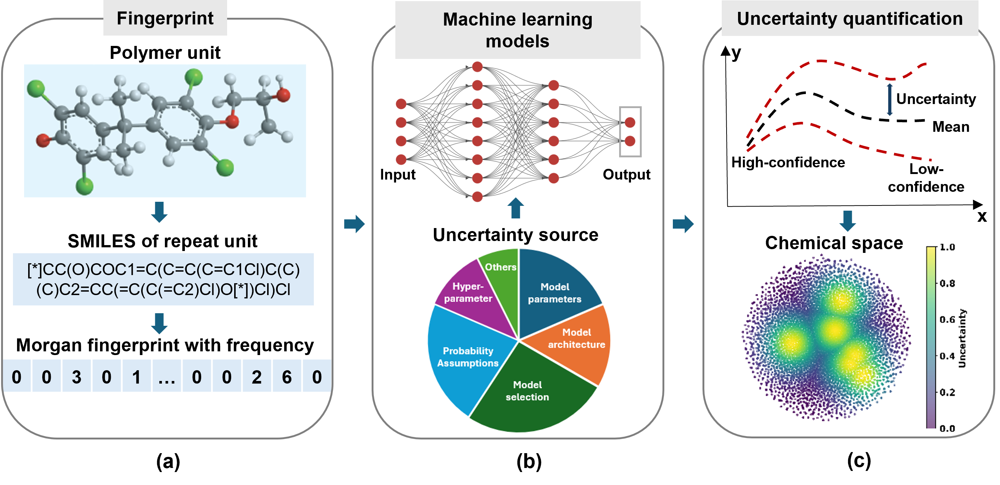
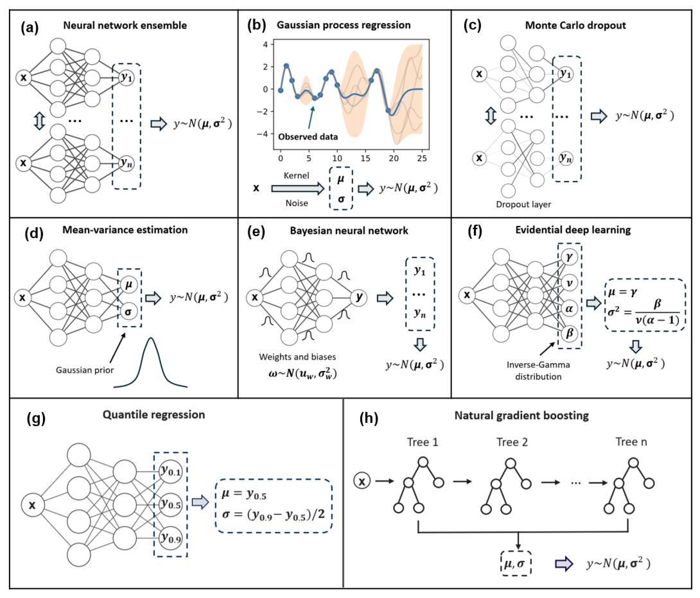

# Uncertainty Quantification in Machine Learning for Polymer Properties: A Benchmark Study
---
**Code repository for the above titled paper.**
**In notebook, we provide a step-by-step guide to reproduce the results of Tm in the paper.**
## Workflow

## Dataset

* Tg: Glass transition temperature; Eg: Band gap; Tm: Melting temperature; Td: Decomposition temperature.
* Tg^EXP: represents out-of-distribution experimental Tg data from journal papers.
* Tg^MD: represents out-of-distribution Tg data derived from MD simulations in the PoLyInfo.
## Methods

* Neural network ensemble: Pytorch
* Gaussian process regression (GPR): [GPy](https://github.com/SheffieldML/GPy/tree/deploy)
* Monte Carlo dropout (MCD): Pytorch
* Mean-variance estimation (MVE): Pytorch
* Bayesian neural network (BNN): Pytorch
* Evidential deep learning (EDL): Pytorch, [Chemprop](https://github.com/aamini/chemprop)

### Input
* Morgan fingerprint with frequency (MFF): Considering the number of substructures

### Output
* Mean and standard deviations for polymer properties

## Metrics
* R2, MAE, RMSE
* Spearman's rank correlation coefficient
* Calibration

More details can be found in the paper.